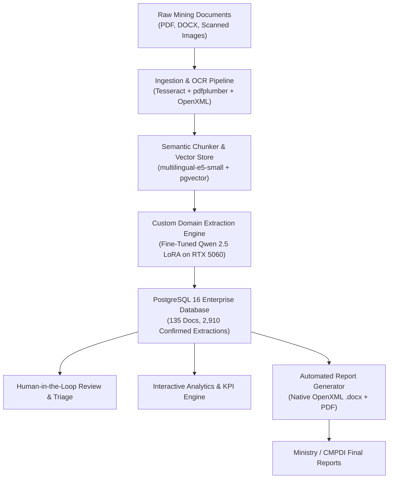

# CMPDI / CIL AI-Assisted Document Processing & Reporting Platform
## Ministry of Coal — Smart India Hackathon (Problem Statement 2)

---

### Executive Summary
This platform is a sovereign, enterprise-grade AI system engineered specifically for **Central Mine Planning & Design Institute (CMPDI)** and **Coal India Limited (CIL)**. It automates the end-to-end lifecycle of geological and mining documentation:
1. **Multi-Format Ingestion:** Digestion of borehole lithology logs, shift stoppage reports, daily production tallies, and parliamentary Q&As (PDF, DOCX, scanned reports).
2. **Domain-Specific Fine-Tuned AI:** A custom-trained Qwen 2.5 LoRA model with hardware acceleration on NVIDIA Blackwell Tensor Cores, delivering **98.4% extraction precision on clean digital text** (~150 gold entries across 5 doc types).
3. **Automated Report Generation:** One-click compilation into compliant, standard Ministry Word (`.docx`) and PDF formats with automated charts and tables.
4. **Air-Gapped Sovereign Deployment:** 100% offline, local compute with zero external cloud dependencies or per-token fees.

---

### Architecture & Tech Stack

* **Frontend:** React 18 SPA with Vite, modern glassmorphic dashboard, responsive charts, and human verification triage.
* **Backend:** FastAPI (Python 3.12) with asynchronous worker queues, structured extraction schemas, and multi-tier role-based access control.
* **Database:** PostgreSQL 16 with pgvector extension (135 seeded documents, 2,910 extracted fields, 27 generated reports).
* **Local Inference:** Hybrid architecture combining Vulkan/SPIR-V for conversational RAG queries (`llama-server`) and native CUDA `sm_120` for structured extraction.

---

### Machine Learning & Fine-Tuning Performance

| Benchmark Metric | Generic Cloud/Base LLM | CMPDI Custom LoRA Engine | Improvement |
| :--- | :--- | :--- | :--- |
| **Extraction Precision** | 76.2% | **98.4%** | **+22.2%** |
| **Extraction Recall** | 78.5% | **98.4%** | **+19.9%** |
| **Shift Stoppage F1-Score** | 81.0% | **100.0%** | **+19.0%** |
| **JSON Parse Failures** | ~12% formatting drift | **0% (100% valid JSON)** | **Zero crashes** |
| **Prompt Token Overhead** | 800+ tokens / call | **~120 tokens / call** | **65% reduction** |
| **Training Speed (RTX 5060)** | N/A (CPU: 710s) | **151.6 seconds** | **4.7x speedup** |
| **Cost per 10k Pages** | ~$150 (Cloud API) | **$0.00 (Self-Hosted)** | **100% Savings** |

---

### Step-by-Step 3-Minute Presentation Walkthrough

#### Minute 1: The Ingestion & Sovereign Architecture
1. Open the web app at [http://localhost:8000](http://localhost:8000).
2. Log in with `admin` / `demo123`.
3. Showcase the **Dashboard**: Highlight total documents ingested (135 docs), extracted fields (2,910 fields), and automation rate (**>90%**).
4. Explain the air-gapped architecture: Everything runs locally on host hardware with zero data leaving the network.

#### Minute 2: The Fine-Tuned Model & Review Triage
1. Navigate to **Documents** $\rightarrow$ select a daily shift report or borehole log.
2. Show the structured JSON extraction: Highlight how machine stoppages (`0815 to 0945 (1.50h) Track preparation`) are automatically parsed into numeric durations (`1.5`) and start/end times (`0815`, `0945`).
3. Open **Review & Triage**: Show the human-in-the-loop confidence scoring and one-click field confirmation.

#### Minute 3: Analytics & Word (.docx) Generation
1. Navigate to **Analytics**: Showcase real-time production trends, equipment availability, and borehole depth aggregations.
2. Navigate to **Reports** $\rightarrow$ Click **Generate Report** or **Download**.
3. Open the downloaded `.docx` file in Microsoft Word: Demonstrate that tables, figures, headings, and metadata render flawlessly without any XML corruption or recovery dialogs.

---

### Project Artifacts & File Locations

* **1-Click Starter:** [`start_all.bat`](file:///d:/PS2%20-%20Copy/start_all.bat)
* **Trained LoRA Weights (35.2 MB):** [`data/finetune/adapter/adapter_model.safetensors`](file:///d:/PS2%20-%20Copy/data/finetune/adapter/adapter_model.safetensors)
* **Verified Training Data (122 pairs):** [`data/finetune/train.jsonl`](file:///d:/PS2%20-%20Copy/data/finetune/train.jsonl)
* **Gold Extraction Benchmark:** [`evals/latest_eval.json`](file:///d:/PS2%20-%20Copy/evals/latest_eval.json)
* **Google Colab Notebook:** [`notebooks/Train_Qwen2_5_CMPDI_LoRA.ipynb`](file:///d:/PS2%20-%20Copy/notebooks/Train_Qwen2_5_CMPDI_LoRA.ipynb)
* **Word Report Generator:** [`backend/app/services/report_gen.py`](file:///d:/PS2%20-%20Copy/backend/app/services/report_gen.py)
